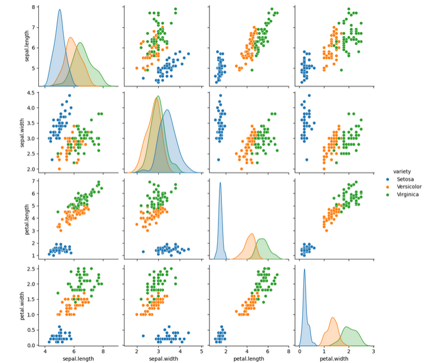
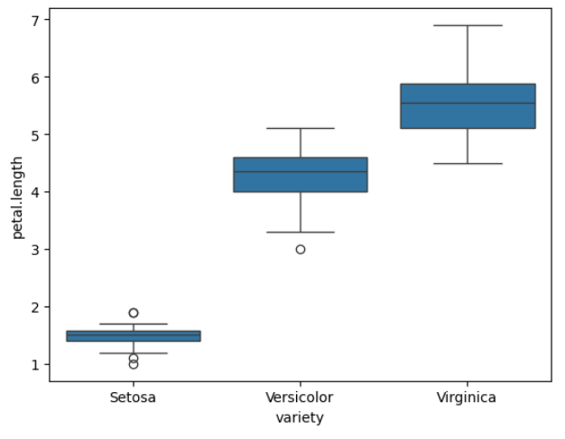

# Overview
* This project involves analyzing and visualizing the Iris dataset using Python. The analysis includes loading the dataset, inspecting it, and generating various plots to understand its features and distributions.

## Table of Contents
- [Requirements](#requirements)
- [Files](#files)
- [How to Run](#how-to-run)
- [Example Output](#example-output)

## Requirements
* pandas
* numpy
* matplotlib
* seaborn

# You can install these libraries using pip:
```bash
pip install pandas numpy matplotlib seaborn
```

# Clone repository
```bash
git remote add origin https://github.com/AviralTechie/ViLearnX-Task-1.git
```
## Files
* iris.csv: The Iris dataset file in CSV format.
* task-1.ipynb : Python script for data analysis and visualization.

1. Load the Iris Dataset
* Reads the Iris dataset from iris.csv.
  
2. Inspect the Dataset
* Displays the first few rows of the dataset.
* Prints the shape of the dataset.
* Provides information about the dataset.
* Shows descriptive statistics.
* Checks for missing values.

3. Visualizations
* Histograms: Displays histograms for each feature in the dataset.
* Box Plots: Visualizes the distribution of sepal.length and petal.length across different Iris varieties.
* Count Plot: Shows the count of samples for each Iris variety.
* Pair Plot: Illustrates pairwise relationships between features, colored by Iris variety.

## How to Run

1. Ensure you have the required libraries installed.
2. Place the iris.csv file in the same directory as the <filename> script.
3. Run the script using Python:
```bash
python analysis.py
```

## Example Output



# Author
* Aviral - https://github.com/AviralTechie
